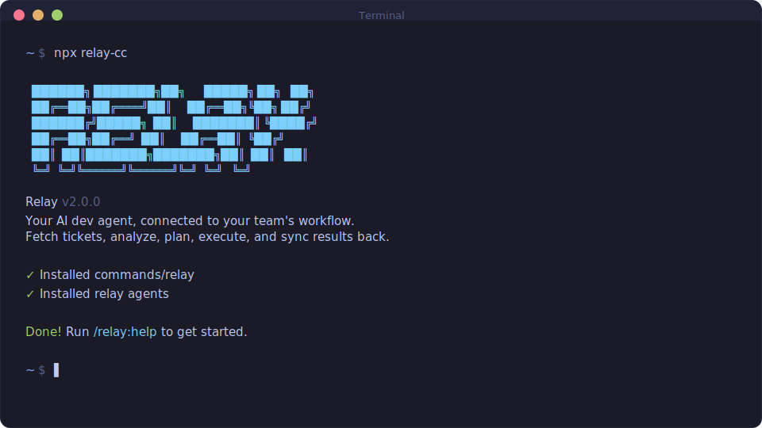

<div align="center">

# RELAY

**Your AI dev agent, connected to your team's workflow.**

**Fetch tickets from Jira, GitHub Issues, or Azure DevOps — analyze, plan, execute, and sync results back.**

[](https://www.npmjs.com/package/relay-cc)
[](https://www.npmjs.com/package/relay-cc)
[](https://github.com/ibnyusrat/relay)
[](LICENSE)

<br>

```bash
npx relay-cc
```

**Works on Mac, Windows, and Linux.**

<br>



<br>

[How It Works](#how-it-works) · [Getting Started](#getting-started) · [Commands](#commands) · [Configuration](#configuration)

> Fork of [glittercowboy/relay](https://github.com/glittercowboy/relay) (originally [Get Shit Done](https://github.com/glittercowboy/relay)). All credit for the core architecture goes to the original project.

</div>

---

## How It Works

Relay connects Claude Code to your team's ticket system. One command takes a ticket from assignment to completion:

```
/relay:work PROJ-123
```

Six stages, fully orchestrated:

1. **Fetch** — Pull ticket details from Jira/GitHub/Azure DevOps, create a git branch
2. **Analyze** — Spawn a researcher agent to map ticket requirements against your codebase
3. **Plan** — Create an executable plan with atomic tasks, verified against acceptance criteria
4. **Confirm** — Present analysis + plan for your approval before any code is written
5. **Execute** — Spawn executor agents with fresh 200k context per task, atomic commits
6. **Verify & Sync** — Check acceptance criteria, post results back to your ticket system

The complexity is in the system, not in your workflow. Behind the scenes: context engineering, XML prompt formatting, subagent orchestration, state management. What you see: a few commands that just work.

### Why Subagents?

Every stage spawns specialized agents in fresh context windows. Your main session stays lean while agents burn through investigation, planning, and implementation in their own 200k-token contexts.

| Stage | Orchestrator does | Agents do |
|-------|------------------|-----------|
| Analyze | Collects ticket + codebase context | Researcher maps requirements to code |
| Plan | Validates, manages iteration | Planner creates tasks, checker verifies |
| Execute | Groups into waves, tracks progress | Executors implement with fresh context |
| Verify | Presents results, routes next | Verifier checks against acceptance criteria |

### Atomic Git Commits

Each task gets its own commit with ticket ID:

```
feat(PROJ-123): create user registration endpoint
feat(PROJ-123): add email confirmation flow
fix(PROJ-123): handle duplicate email edge case
docs(PROJ-123): complete user registration
```

Git bisect finds exact failing task. Each commit independently revertable. Clean history for future sessions.

---

## Getting Started

### Install

```bash
npx relay-cc
```

The installer prompts you to choose:
1. **Runtime** — Claude Code, OpenCode, Gemini, or all
2. **Location** — Global (all projects) or local (current project only)

Verify with `/relay:help` inside your chosen runtime.

### Connect Your Ticket System

```
/relay:setup
```

Relay detects available MCP integrations (Jira, GitHub Issues, Azure DevOps) and configures your project. Optionally maps your existing codebase for better ticket analysis.

### Start Working

```
/relay:tickets          # Browse available tickets
/relay:work PROJ-123    # Fetch, analyze, plan, execute, verify, sync
```

### Staying Updated

```bash
npx relay-cc@latest
```

<details>
<summary><strong>Non-interactive Install (Docker, CI, Scripts)</strong></summary>

```bash
# Claude Code
npx relay-cc --claude --global   # Install to ~/.claude/
npx relay-cc --claude --local    # Install to ./.claude/

# OpenCode (open source, free models)
npx relay-cc --opencode --global # Install to ~/.config/opencode/

# Gemini CLI
npx relay-cc --gemini --global   # Install to ~/.gemini/

# All runtimes
npx relay-cc --all --global      # Install to all directories
```

Use `--global` (`-g`) or `--local` (`-l`) to skip the location prompt.
Use `--claude`, `--opencode`, `--gemini`, or `--all` to skip the runtime prompt.

</details>

<details>
<summary><strong>Development Installation</strong></summary>

Clone the repository and run the installer locally:

```bash
git clone https://github.com/ibnyusrat/relay.git
cd relay
node bin/install.js --claude --local
```

Installs to `./.claude/` for testing modifications before contributing.

</details>

### Recommended: Skip Permissions Mode

Relay is designed for frictionless automation. Run Claude Code with:

```bash
claude --dangerously-skip-permissions
```

> [!TIP]
> This is how Relay is intended to be used — stopping to approve `date` and `git commit` 50 times defeats the purpose.

<details>
<summary><strong>Alternative: Granular Permissions</strong></summary>

If you prefer not to use that flag, add this to your project's `.claude/settings.json`:

```json
{
  "permissions": {
    "allow": [
      "Bash(date:*)",
      "Bash(echo:*)",
      "Bash(cat:*)",
      "Bash(ls:*)",
      "Bash(mkdir:*)",
      "Bash(wc:*)",
      "Bash(head:*)",
      "Bash(tail:*)",
      "Bash(sort:*)",
      "Bash(grep:*)",
      "Bash(tr:*)",
      "Bash(git add:*)",
      "Bash(git commit:*)",
      "Bash(git status:*)",
      "Bash(git log:*)",
      "Bash(git diff:*)",
      "Bash(git tag:*)"
    ]
  }
}
```

</details>

---

## Supported Integrations

Relay connects to your ticket system via MCP (Model Context Protocol) servers:

| System | MCP Server | Detection |
|--------|-----------|-----------|
| **Jira** | Any Jira MCP server | `mcp__jira__*` tools |
| **GitHub Issues** | GitHub MCP server | `mcp__github__*` tools |
| **Azure DevOps** | Azure DevOps MCP server | `mcp__azure_devops__*` tools |

Configure your MCP server in Claude Code settings, then run `/relay:setup` to connect.

---

## Commands

### Core Workflow

| Command | What it does |
|---------|--------------|
| `/relay:setup` | Connect to Jira/GitHub Issues/Azure DevOps |
| `/relay:tickets` | Browse available tickets |
| `/relay:work <id>` | Fetch → analyze → plan → confirm → execute → verify → sync |
| `/relay:estimate <id>` | Estimate effort before committing (complexity, time, impact) |
| `/relay:resume <id>` | Resume a specific ticket by ID (detects stage, switches branch) |

### Quick Tasks

| Command | What it does |
|---------|--------------|
| `/relay:quick` | Execute ad-hoc task with Relay guarantees (skip analysis) |

### Code Review & PRs

| Command | What it does |
|---------|--------------|
| `/relay:pr [id]` | Create PR from ticket work (auto-generates title/description) |
| `/relay:review` | Review a PR or address review comments on your own PR |
| `/relay:rollback <id>` | Safely revert ticket work via `git revert` |

### Status & Navigation

| Command | What it does |
|---------|--------------|
| `/relay:status` | Check current state and route to next action |
| `/relay:history [filter]` | Show completed ticket history with outcomes |
| `/relay:help` | Show all commands and usage guide |
| `/relay:update` | Update Relay with changelog preview |

### Session Management

| Command | What it does |
|---------|--------------|
| `/relay:pause-work` | Create context handoff when stopping mid-ticket |
| `/relay:resume-work` | Restore from last session |

### Utilities

| Command | What it does |
|---------|--------------|
| `/relay:map-codebase` | Analyze existing codebase (7 focused documents) |
| `/relay:debug [desc]` | Systematic debugging with persistent state |
| `/relay:add-todo [desc]` | Capture idea for later |
| `/relay:check-todos` | List pending todos |
| `/relay:settings` | Configure model profile and workflow agents |
| `/relay:set-profile <profile>` | Switch model profile (quality/balanced/budget) |

---

## Configuration

Relay stores project settings in `.relay/config.json`. Configure during `/relay:setup` or update later with `/relay:settings`.

### Model Profiles

Control which Claude model each agent uses. Balance quality vs token spend.

| Profile | Planning | Execution | Verification |
|---------|----------|-----------|--------------|
| `quality` | Opus | Opus | Sonnet |
| `balanced` (default) | Opus | Sonnet | Sonnet |
| `budget` | Sonnet | Sonnet | Haiku |

Switch profiles:
```
/relay:set-profile budget
```

### Workflow Agents

Optional agents that improve quality but add tokens and time.

| Setting | Default | What it does |
|---------|---------|--------------|
| `workflow.research` | `true` | Research codebase before planning |
| `workflow.plan_check` | `true` | Verify plans achieve ticket goals |
| `workflow.verifier` | `true` | Confirm acceptance criteria met |

### Git Branching

| Setting | Default | What it does |
|---------|---------|--------------|
| `git.branching_strategy` | `ticket` | Branch per ticket |
| `git.ticket_branch_template` | `{ticket_id}/{slug}` | Branch name format |

### Planning

| Setting | Default | What it does |
|---------|---------|--------------|
| `planning.commit_docs` | `true` | Track `.relay/` artifacts in git |

---

## File Structure

```
.relay/
├── config.json              # Integration config, workflow settings
├── STATE.md                 # Active ticket, recent history, velocity
├── codebase/                # Codebase map (7 documents)
├── tickets/
│   └── PROJ-123/
│       ├── ESTIMATE.md      # Pre-work effort estimate
│       ├── ANALYSIS.md      # Codebase-aware ticket analysis
│       ├── PLAN.md          # Executable plan
│       ├── SUMMARY.md       # Execution results
│       └── VERIFICATION.md  # Acceptance criteria check
├── reviews/                 # PR review documents
├── debug/                   # Debug sessions
├── quick/                   # Quick task artifacts
└── todos/                   # Captured ideas
    ├── pending/
    └── done/
```

---

## Security

### Protecting Sensitive Files

Relay's codebase mapping and analysis commands read files to understand your project. **Protect files containing secrets** by adding them to Claude Code's deny list:

1. Open Claude Code settings (`.claude/settings.json` or global)
2. Add sensitive file patterns to the deny list:

```json
{
  "permissions": {
    "deny": [
      "Read(.env)",
      "Read(.env.*)",
      "Read(**/secrets/*)",
      "Read(**/*credential*)",
      "Read(**/*.pem)",
      "Read(**/*.key)"
    ]
  }
}
```

This prevents Claude from reading these files entirely, regardless of what commands you run.

> [!IMPORTANT]
> Relay includes built-in protections against committing secrets, but defense-in-depth is best practice. Deny read access to sensitive files as a first line of defense.

---

## Troubleshooting

**Commands not found after install?**
- Restart Claude Code to reload slash commands
- Verify files exist in `~/.claude/commands/relay/` (global) or `./.claude/commands/relay/` (local)

**Commands not working as expected?**
- Run `/relay:help` to verify installation
- Re-run `npx relay-cc` to reinstall

**Updating to the latest version?**
```bash
npx relay-cc@latest
```

**Using Docker or containerized environments?**

If file reads fail with tilde paths (`~/.claude/...`), set `CLAUDE_CONFIG_DIR` before installing:
```bash
CLAUDE_CONFIG_DIR=/home/youruser/.claude npx relay-cc --global
```
This ensures absolute paths are used instead of `~` which may not expand correctly in containers.

### Upgrading from GSD

If you previously used Get Shit Done (GSD), the installer automatically:
- Removes old `commands/gsd/` and agent files
- Updates hooks and settings references
- Cleans up old cache files

Your existing `.planning/` project data is not modified. Relay uses `.relay/` for new projects.

### Uninstalling

To remove Relay completely:

```bash
# Global installs
npx relay-cc --claude --global --uninstall
npx relay-cc --opencode --global --uninstall

# Local installs (current project)
npx relay-cc --claude --local --uninstall
npx relay-cc --opencode --local --uninstall
```

This removes all Relay commands, agents, hooks, and settings while preserving your other configurations.

---

## License

MIT License. See [LICENSE](LICENSE) for details.

---

<div align="center">

**Claude Code is powerful. Relay makes it reliable.**

</div>
